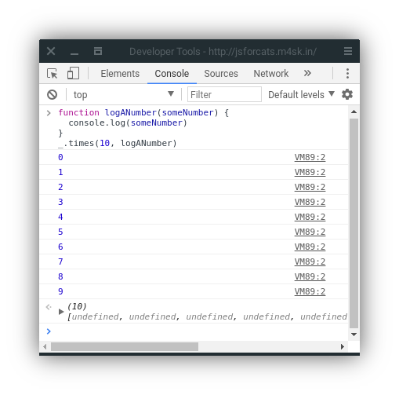
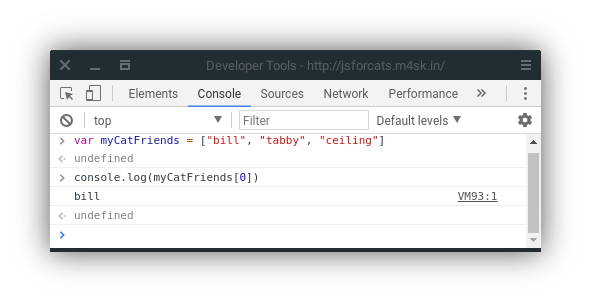
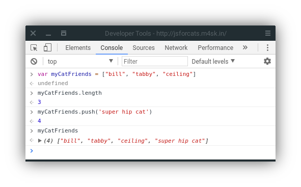
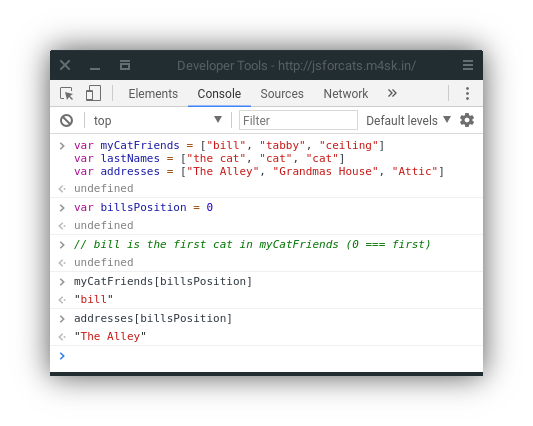
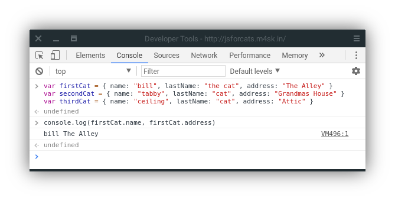
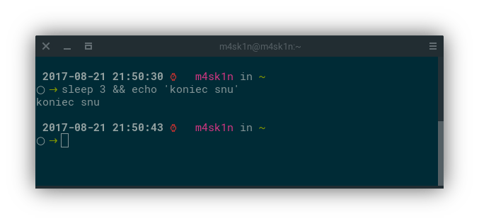

<span class="bigTitle">JavaScript dla kotów</span>
## Wprowadzenie dla początkujących programistów <span class="right"></span>
### *Tak proste, że nawet twój ludzki towarzysz dałby radę!*

JavaScript jest językiem programowania, czyli innymi słowy językiem, którym instruujesz komputer, co ma robić. Tak, jak kontrolujesz człowieka używając syczenia i miauczenia, tak komputer jest kontrolowany z użyciem instrukcji w języku programowania. Wszystkie współczesne przeglądarki internetowe obsługują JavaScript, więc możesz wykorzystać jego możliwości do naprawdę szalonych rzeczy!

JavaScript powstał, aby uczynić stroni internetowe bardziej interaktywnymi. Obecnie jest używany nie tylko w przeglądarkach, ale także na serwerach, smartfonach, a nawet robotach! Ta strona nauczy cię podstaw JavaScript bez zabierania zbędnego czasu*, więc szybciej zaczniesz działać.

\* *W praktyce: trochę więcej. Zapewne godzinę lub dwie. Pamiętaj, że będąc kotem wolisz raczej leżeć w słońcu niż biegać…*

JavaScript dla kotów jest dostępny na licencji [CC BY 4.0](https://creativecommons.org/licenses/by/4.0/deed.pl)

## Spis treści

- [Konsola](#basics)
- [Ciągi znaków](#strings)
- [Wartości i zmienne](#values)
- [Korzystanie z funkcji](#functions)
- [Wbudowane funkcje JS](#standard-library)
- [Pobieranie nowych funkcji](#third-party-javascript)
- [Pisanie własnych funkcji](#writing-functions)
- [Pętle](#loops)
- [Tablice](#arrays)
- [Obiekty](#objects)
- [Wywołania zwrotne](#callbacks)
- [Do przeczytania później](#recommended-reading)

## Nie bój się!

<span class="right"></span>

Zawsze wylądujesz na czterech łapach &mdash; nawet programując! W przeciwieństwie do [przesuwania łapą szklanki z wodą](images/dealwithit.gif) nad laptopem, _nic_ nie wydarzy się twojemu komputerowi w trakcie tego kursu, nawet jeżeli wpiszesz niepoprawną komendę, lub naciśniesz nieodpowiedni przycisk. Tak jak koty, programiści co chwilę popełniają błędy. Mylą rzeczy, zapominają cudzysłowiów, nawiasów i zapominają, jak działają podstawowe funkcje (tj. włóczka lub laser). Programiści starają się bardziej, aby program _kiedykolwiek_ zadziałał, aniżeli miałby zadziałać za pierwszym razem. Najlepiej uczyć się na błędach!

Nie musisz się obawiać! Najgorszą rzeczą, jaka może się stać będzie konieczność odświeżenia strony, jeżeli zabłądzsz. Nie przejmuj się, to dzieje się bardzo rzadko.

## <a id="basics" href="#basics">#</a> Podstawy

Na tej stronie działa JavaScript. Pobawmy się nim trochę. Dla uproszczenia zakładam, że korzystasz z Google Chrome (lub pochodnej, np. Opera, Chromium, Vivaldi…), jeżeli nie, będzie nam łatwiej, jeżeli będziesz korzystać z Chrome.

Na początek, naciśnij prawym przyciskiem na stronie i wybierz **Zbadaj element**, następnie przejdź do karty **Konsola**. Powinieneś zobaczyć coś takiego:


Jest to konsola, zwana często „wierszem poleceń” lub „terminalem”. Pozwala na wprowadzenie polecenia, na które dostaniemy natychmiastową odpowiedź. Jest bardzo użytecznym narzędziem do nauki (nadal korzystam z konsoli prawie każdego dnia, kiedy programuję).

W konsoli możemy zrobić trochę fajnych rzeczy. Gdy zacznę pisać, konsola podpowiada mi, jakie polecenia istnieją! Zobacz, co się stanie, gdy wpiszesz ‘1 + 1’ i naciśniesz Enter.

Korzystanie z konsoli jest ważnym elementem nauki JavaScript. Jeżeli nie wiesz, jak coś działa lub jakiego polecenia chcesz użyć, przejdź do konsoli i wypróbuj to! Przykład:

### <a id="strings" href="#strings">#</a> Ciągi znaków

Będąc kotem, chcesz zastąpić wszystkie wystąpienia słowa „psy” w Internecie frazą „te podłe kundle”. Na początek wprowadź w konsolę kilka zdań zawierających słowo „psy” przynajmniej raz. W JavaScript, zbiór liter, cyfr i innych znaków nazywany jest **ciągiem znaków** (z ang. *string*). Ciągi znaków muszą zaczynać się I kończyć znakiem cudzysłowiu. Dozwolony jest zarówno pojedynczy (`'`), jak i podwójny (`"`), ale pamiętaj, aby użyć tego samego znaku na początku i na końcu.


Widzisz tą okropną wiadomość o błędzie? Nie martw się – nie zrobiłeś nic nielegalnego. SyntaxError ILLEGAL jest jedynie komunikatem oznaczającym błąd w programie. Pierwsze dwa zdania miały pasujące znaki cudzysłowiu, ale łącząc oba, napotkał mnie błąd.

Dobrze, aby naprawić te zdania (zastępując „psy” naszą poprawioną wersją), musimy zapisać oryginalne zdania, aby wywołać je później w trakcie magicznego zastępowania. Zauważyłeś, że ciąg znaków jest powtarzany, kiedy wprowadzisz go w konsolę? To dlatego, że nie kazaliśmy zapisać komputerowi tego zdania, więc powraca ono do nas (lub pojawia się komunikat o błędzie, jeżeli zrobiliśmy coś nie tak).

### <a id="values" href="#values">#</a> Wartości i zmienne

**Wartości** (z ang. *values*) są najprostszymi komponentami w JavaScript. `1` jest wartością, `true` jest wartością, `"hello"` jest wartością, `function() {}` jest wartością, a lista jest jeszcze dłuższa! Jest wiele różnych **typów** wartości w JavaScript, ale nie musisz ich jeszcze znać &mdash; poznasz je w trakcie dalszej nauki, w miarę potrzeb.

Do przechowywania wartości używamy **zmiennych** (po ang. *variable*). Zmienna może przechowywać różne typy wartości, które mogą być zmieniane wielokrotnie. To tak jak skrzynki pocztowe. Przechowujemy coś w zmiennej, np. zdanie i przekazujemy zmiennej adres, którego możemy użyć później. W rzeczywistości skrzynki pocztowe posiadają swój numer, ale w JavaScript może to być dowolny ciąg małych liter i cyfr, bez spacji.


`var` jest skrótem wyrazu “variable”, a `=` oznacza *przechowaj wartość po prawej stronie w zmiennej po lewej stronie znaku*. Dodatkowo, jak mogłeś zauważyć, ponieważ przechowujemy wartość w zmiennej, konsola nie zwraca wpisanego zdania, lecz `undefined` (nieokreślony) co w tym przypadku oznacza *brak wartości do zwrócenia*.

Jeżeli wprowadzisz nazwę wartości w konsolę, zostanie wyświetlona jej wartość. Przechowywane wartości zostaną utracone, jeżeli zmienisz stronę. Dla przykładu, jeżeli odświeżę stronę, moja zmienna `dogSentence` zostanie wyczyszczona i przestanie istnieć. Nie przejmuj się tym na razie &mdash; używając klawiszy strzałek możesz powtórzyć ostatnio wykonywane polecenia.

### <a id="functions" href="#functions">#</a> Funkcje

Ponieważ przechowujemy już wartość w zmiennej, teraz zmieńmy jej wartość! Możemy użyć do tego *funkcji* (*function*). Funkcje to rodzaje wartości, spełniające określone zadanie (akcję).

JavaScript posiada funkcję o nazwie `replace`, która robi dokładnie to, czego oczekujemy! Funkcje przyjmują dowolną liczbę parametrów w nawiasach (zero, jedną lub więcej) i zwracają albo `undefined`, albo zmieniony ciąg znaków lub inną wartość. Funkcja `replace` może być używana na każdym ciągu znaków i wymaga podania dwóch wartości: ciąg znaków do usunięcia i ciąg znaków, który go zastąpi. Może to być ciężkie do zrozumienia, więc spójrz na przykład:


Zauważyłeś, że `dogSentence` nie zmienia się po wykonaniu `replace`? To dlatego, że `replace`, (i większość podobnych funkcji) pobiera wartość i zwraca **nową wartość**, bez modyfikacji przekazanej. Ponieważ nie przekazaliśmy wyniki działania funkcji (brak `=` przed funkcją `replace`) wynik został jedynie przedstawiony w konsoli.

### <a id="standard-library" href="#standard-library">#</a> „Biblioteka standardowa”

Możesz zastanawiać się, ile (i jakie) funkcji znajduje się jeszcze w JavaScript. Odpowiedź: DUUUUŻO!  Jest wiele **wbudowanych, ustandaryzowanych bibliotek**, o których możesz dowiedzieć się na MDN (strona Mozilli zawierająca dokładne informacje o technologiach webowych). Przykładowo, [strona JS'owego obiektu Math](https://developer.mozilla.org/en-US/docs/JavaScript/Reference/Global_Objects/Math).

### <a id="third-party-javascript" href="#third-party-javascript">#</a> Biblioteki osób trzecich

Jest wiele kodu JavaScript przeznaczonego do ponownego użytku, który **nie jest wbudowany**. Taki kod JavaScript osób trzecich zwykle jest nazywany „bibliotekami” (libraries) lub „wtyczkami” (plugins). Jedną z moich ulubionych jest **Underscore.js**. Zdobądźmy go i użyjmy na stronie! Na początek odwiedźmy [http://underscorejs.org/](http://underscorejs.org/) i naciśnijmy odnośnik do pobrania (zwykle używam wersji rozwojowych, ponieważ są łatwiejsze w czytaniu i posiadają tą samą podstawową funkcjonalność). Następnie skopiuj kod biblioteki do schowka (możesz użyć opcji Zaznacz wszystko) Wklej go w konsolę i naciśnij enter. Przeglądarka ma teraz nową wartość: `_`. Underscore daje wiele przydatnych funkcji. Nauczysz się z nich korzystać później.


### <a id="writing-functions" href="#writing-functions">#</a> Pisanie własnych funkcji

Nie jesteś ograniczony do korzystania z funkcji napisanych przez innych &mdash; możesz też utworzyć własną. Zróbmy to! Utwórzmy prostą funkcję `makeMoreExciting` , która doda kilka wykrzykników na koniec zdania, czyniąc zdanie dużo bardziej ekscytującym.

    function makeMoreExciting(string) {
      return string + '!!!!'
    }

Można to odczytać jako: „istnieje funkcja 'make more exciting', która pobiera ciąg znaków i zwraca jego kopię z dodatkowymi wykrzyknikami na końcu”. Tak napisalibyśmy to w konsoli, gdybyśmy nie użyli funkcji


Wyrażenie `string + '!!!!'` zwraca nowy wiersz, a nasza zmienna o nazwie `string` nie zmienia swojego stanu.

Wykorzystajmy naszą funkcją, zamiast robić to manualnie. Po pierwsze, wklej funkcję w konsolę i **wywołaj** ją **przekazując** argument w postaci ciągu znaków:


Możesz też wywołać tą samą funkcję przekazując zmienną wskazującą na ciąg znaków (w powyższym przykładzie po prostu wprowadziliśmy zmienną, zamiast zapisywać ją do zmiennej):


Wiersz `makeMoreExciting(sentence)` jest równoznaczny z poleceniem `sentence + '!!!!'`. Co, jeżeli chcemy **zapisać** (zaktualizować) wartość zdania? Zapiszmy zwracaną wartość do naszego zdania.

    var sentence = "time for a nap"
    sentence = makeMoreExciting(sentence)

Od teraz `sentence` posiada znak równości! Pamiętaj, że używasz słowa kluczowego `var` tylko podczas **inicjalizacji** zmiennej &mdash; przy jej pierwszym użyciu. Nie powinieneś później używać `var` jeżeli nie zamierzasz ponownie inicjalizować (wyczyścić) tej wartości.

Co się stanie, jeżeli usuniemy instrukcję `return` z funkcji?


Dlaczego zmienna `sentence` jest pusta? Funkcje domyślnie zwracają `undefined`! Możesz wybrać wartość zwracaną przez funkcję. Funkcje powinny pobierać wartość i zwracać ją. (ciekawostka: nazywają to mądrze *programowaniem funkcyjnym*). Następna funkcja, która nie zwraca żadnej wartości, ale używa innej metody, aby wyświetlić wynik:

```js
function yellIt(string) {
  string = string.toUpperCase()
  string = makeMoreExciting(string)
  console.log(string)
}
```

Funkcja `yellIt` korzysta z naszej funkcji `makeMoreExciting` oraz wbudowanej metody [toUpperCase](https://developer.mozilla.org/en-US/docs/JavaScript/Reference/Global_Objects/String/toUpperCase). Metody to po prostu funkcje, które należą do czegoś &mdash; w tym przypadku do ciągu znaków (możemy nazywać ją zarówno metodą, jak i funkcją). `makeMoreExciting` nie należy do niczego, więc technicznie nie jest funkcją (może to być skomplikowane, wiem…).

Ostatni wiersz funkcji po prostu wyświetla podaną wartość w konsoli.


Jest więc coś nie tak z powyższą funkcją? To zależy! Istnieją dwa główne rodzaje funkcji:

  - funkcje, które modyfikują lub tworzą wartości i zwracają je
  - funkcje pobierające wartości i wykonujące na nich operacje, nie zwracając niczego

`console.log` jest przykładem drugiego rodzaji funkcji: wyświetla tekst w konsoli &mdash; możesz zobaczyć efekt działania funkcji, ale nie może zostać on reprezentowany w formie wartości JavaScript. Moją zasadą jest starać się, aby istniały oba rodzaje funkcji, niezależnie od siebie. Tak wygląda napisana na nowo funkcja `yellIt`:

```js
function yellIt(string) {
  string = string.toUpperCase()
  return makeMoreExciting(string)
}

console.log(yellIt("nie boję się ludzi"))
```

W ten sposób `yellIt` staje się bardziej **ogólne**, co oznacza że funkcja spełnia wyłącznie swoje zadanie, nie wyświetlając wyniku &mdash; ta możliwość może zostać dodana później, poza deklaracją funkcji.

### <a id="loops" href="#loops">#</a> Pętle

Teraz, gdy mamy pod pasem podstawowe umiejętności (*Od autora: czy koty noszą pasy?*) możemy się trochę rozleniwić. Co?! Tak, to prawda: programowanie uczy lenistwa. Larry Wall, twórca języka programowania Perl, nazwał lenistwo [najważniejszą cechą](http://c2.com/cgi/wiki?LazinessImpatienceHubris) dobrego programisty. Jeżeli komputery nie wykonywałyby naszych zadań, musielibyśmy robić to wszystko ręcznie, zamiast opalać się w słońcu, podczas gdy program działa dla ciebie. Czy to nie wspaniałe?

Pętle (*loops*) są jednym z najważniejszych sposobów na opanowanie możliwości komputera. Pamiętasz wspomniane wcześniej `Underscore.js`? Upewnij się, że załadowałeś je. (pamiętaj: możesz użyć strzałki w górę na klawiaturze i nacisnąć enter) i wklej ten kod w konsolę:
  
```js
function logANumber(someNumber) {
  console.log(someNumber)
}
_.times(10, logANumber)
```

Ten kod używa metody Underscore o nazwie [times](http://underscorejs.org/#times), która pobiera jedną liczbę i funkcję, która wyświetla, ile razy wykorzystano funkcję.



Chcąc napisać to ręcznie, wyglądałoby to tak:

```js
logANumber(0)
logANumber(1)
logANumber(2)
logANumber(3)
logANumber(4)
logANumber(5)
logANumber(6)
logANumber(7)
logANumber(8)
logANumber(9)
```

Ale koty nigdy nie wykonują niepotrzebnej pracy, więc musisz pytać siebie, *„czy używam najbardziej leniwej metody, aby to wykonać?”*.

Dlaczego jest to nazywane zapętlaniem? Pomyśl to tak. Jeżeli chcielibyśmy wypisać 10 cyfr (od 0 do 9) używając tablicy w JavaScript, wyglądałoby to tak:

```js
var zeroThroughTen = [0, 1, 2, 3, 4, 5, 6, 7, 8, 9]
```

Metoda `times` w rzeczywistości tworzy taką tablicę i dla każdej liczby wykonuje zadanie: w tym przypadku wywołuje funkcję `logANumber` z obecną liczbą.

### <a id="arrays" href="#arrays">#</a> Tablice

Wspomniałem o nich już kilka razy, ale poświęćmy minutę, aby się ich nauczyć. Wyobraź sobie, że musisz, śledzić wszystkich swoich kocich towarzyszy. Z tablic będzie to proste. Myśl o tablicach, jak o uporządkowanych listach, w których możesz przechowywać wiele elementów.

Jak utworzyć tablicę:

```js
var myCatFriends = ["bill", "tabby", "ceiling"]
```

Teraz masz listę swoich kocich przyjaciół!

Elementy tablicy są przypisywane od numeru 0 w górę. Więc `myCatFriends[0]` zwraca `bill`, a `myCatFriends[1]` &mdash; `tabby`… itd.

Aby uzyskać imiona przyjaciół z naszej nowej tablicy, możesz uzyskać dostęp bezpośrednio, np.:

```js
console.log(myCatFriends[0])
```



Jeżeli byłeś w najmodniejszym klubie kota i zdobyłeś nowego przyjaciela ostatniej nocy, aby łatwo go dodać do tablicy, wprowadź: `myCatFriends.push("super hip cat")`.

Aby sprawdzić, czy nowy kot został dodany do tablicy, użyj `.length`:



Zauważyłeś, że `push` zwróciło długość? Wygodnie! Pamiętaj też, że  i tablice zawsze **zachowują kolejność**, co oznacza, że pamiętają kolejność, w której dodano lub zdefiniowano elementy. Nie wszystko w JavaScript tak działa, więc zapamiętaj tą specyfikę tablic.
  
### <a id="objects" href="#objects">#</a> Obiekty

Tablice są dobre dla list, ale może być ciężko używać ich do innych działań. Wyobraź sobie tablicę kocich przyjaciół. Co, jeżeli chciałbyś przechować więcej, niż tylko imiona?

```js
var myCatFriends = ["bill", "tabby", "ceiling"]
var lastNames = ["the cat", "cat", "cat"]
var addresses = ["The Alley", "Grandmas House", "Attic"]
```

Czasem dobrze jest trzymać wszystkie adresy i imiona w jednej wartości. Ale czasem masz „kota w mózgu”, więc chcesz przywołać Billa i sprawdzić jego adres. Z tablicami zajmuje to dużo pracy, ponieważ nie możesz powiedzieć „tablico, daj mi adres Bill” ponieważ Bill jest w jednej tablicy, a jego adres w zupełnie innej.



Może to być nierozsądne, ponieważ jeżeli zmieni się zawartość tablicy i dodamy nowego kota na początek, powinniśmy zaktualizować też zmienną `billsPosition`, aby zawierała obecny adres Billa. Istnieje prostszy sposób na zarządzanie takimi danymi, wykorzystując obiekty:

```js
var firstCat = { name: "bill", lastName: "the cat", address: "The Alley" }
var secondCat = { name: "tabby", lastName: "cat", address: "Grandmas House" }
var thirdCat = { name: "ceiling", lastName: "cat", address: "Attic" }
```
 
Dlaczego robimy to w ten sposób? Ponieważ teraz mamy zmienną dla każdego kota, której możemy użyć do przechowywania danych w wygodniejszy i czytelniejszy sposób.



Możesz myśleć o obiektach jak o kluczach na breloku. Każdy jest przeznaczony do konkretnych drzwi, i jeżeli są one podpisane, możesz używać ich bez problemu. W rzeczywistości, elementy po lewej od dwukropka nazywane są **kluczami** (lub **właściwościami*"), a elementy po prawej to **wartości** 

```js
// obiekt z kluczem 'name' i jedną wartością 'bill'
{ name: 'bill' }
```

Dlaczego miałbyś więc używać tablic, kiedy możesz użyć obiektów? Niestety, obiekty nie zapamiętują kolejności wprowadzonych danych. Możesz zdefiniować obiekt tak:

```js
{ date: "10/20/2012", diary: "spałem dziś trochę", name: "Charles" }
```

Ale komputer może go wyświetlić tak:

```js
{ diary: "spałem dziś trochę", name: "Charles", date: "10/20/2012" }
```

Albo tak!

```js
{ name: "Charles", diary: "spałem dziś trochę", date: "10/20/2012" }
```

Nie powinieneś więc ufać kolejności kluczy w obiektach. Jeżeli chcesz zrobić to naprawdę dobrze, możesz utworzyć tablicę wypełnioną obiektami, lub obiekt zawierający tablice!

```js
var moodLog = [
  {
    date: "10/20/2012",
    mood: "osadzony"
  }, 
  {
    date: "10/21/2012",
    mood: "zaskoczony"
  },
  {
    date: "10/22/2012",
    mood: "mruczący"
  }
]

// segregowane od najmniej do najbardziej ulubionych
var favorites = {
  treats: ["obserwacja ptaków", "pocieranie brzucha", "kocimiętka"],
  napSpots: ["sofa", "skrzynka", "ludzka twarz"]
}
```

Kiedy łączysz różne rodzaje kontenerów, tworzysz **struktury danych**, jak lego!

### <a id="callbacks" href="#callbacks">#</a> Wywołania zwrotne

Wywołania nie są w rzeczywistości możliwością JavaScript, tak jak obiekty czy tablice, są natomiast jednym ze sposobów na używanie funkcji. Aby zrozumieć, dlaczego odwołania są przydatne, musisz najpierw rozumieć programowanie asynchroniczne (często skracane do **async**). Asynchroniczny kod z definicji jest kodem pisanym w niesynchroniczny sposób. Kod synchroniczny jest prosty do zrozumienia i napisania. Przykład:

```js
var photo = download('http://foo-chan.com/images/sp.jpg')
uploadPhotoTweet(photo, '@maxogden')
```

Ten synchroniczny [pseudokod](http://pl.wikipedia.org/wiki/Pseudokod) pobiera zdjęcie słodkiego kotka, wysyła je na Twitterze i twittuje do `@maxogden`. Proste i zrozumiałe!

(*Od autora: Ja, @maxogden z radością przyjmę każde zdjęcie kota na Twitterze*)

Ten kod jest synchroniczny, ponieważ aby zdjęcie zostało wysłane na Twittera, musi zostać pobrane. Oznacza to, że 2 wiersz nie może zostać wykonany przed zakończeniem 1. Jeżeli chcielibyśmy zaimplementować ten kod, musimy się upewnić, że pobieranie „zablokowało” wykonywanie dalszego kodu, dopóki się nie zakończy, a po zakończeniu, pozwoli na wykonanie dalszego kodu i wykona się drugi wiersz.

Synchroniczny kod jest dobry, kiedy rzeczy dzieją się szybko, ale jest okropny, gdy coś wymaga zapisania, ładowania, pobierania i wysyłania. Co, jeśli serwer z którego pobierasz zdjęcie jest powolny, twoje połączenie z internetem jest powolne, lub komputer z którego korzystasz ma uruchomione za dużo kart z kocimi filmikami, więc działa wolniej? Oznacza to, że będzie trzeba poczekać, zanim 2 linia kodu zostanie wykonana. W międzyczasie, ponieważ cały JavaScript ze strony nie może być wykonywany, strona zamrozi się i utraci responsywność, zanim ukończy się pobieranie.

Blokowanie wykonywania powinno być unikane za wszelką cenę, szczególnie gdy czyni program nieresponsywnym lub mrozi go. Załóżmy, że pobieranie zdjęcia zajmuje jedną sekundę. Aby zilustrować, ile znaczy sekunda dla współczesnego komputera, tutaj znajduje się program, który obliczy, ile zadań potrafi wykonać JavaScript w przeciągu sekundy.

```js
function measureLoopSpeed() {
  var count = 0
  function addOne() { count = count + 1 }

  // Date.now() zwraca ogromną liczbę wyrażoną w milisekundach,
  // które minęły od 1 stycznia 1970
  var now = Date.now()

  // Zapętl tak długo, jak Date.now() nie będzie o 1000 milisekund (1 sekunda) lub
  // więcej od początku pętli. Za każdym razem użyj addOne()
  while (Date.now() - now < 1000) addOne()
  
  // Kiedy będzie to >= 1000ms, wypiszmy liczbę wykonanych zadań
  console.log(count)
}

measureLoopSpeed()
```

Wklej ten mod do swojej konsoli JavaScript, a po sekundzie otrzymasz wypisaną liczbę. Na moim komputerze jest to `8527360`, czyli około **8,5 miliona**. W ciągu jednej sekundy JavaScript może wywołać funkcję `addOne` 8,5 miliona razy! Więc, pobierając zdjęcie kodem synchronicznym, potencjalnie zatrzymuje wykonywanie aż 8,5 miliona operacji!

Niektóre języki posiadają funkcję `sleep`, która blokuje wykonywanie kodu na kilka sekund. Dla przykładu, kod [`bash`](http://en.wikipedia.org/wiki/Bash_%28Unix_shell%29)a uruchomiony na dystrybucji GNU/Linuxa używający polecenia `sleep`. Po wykonaniu `sleep 3 && echo 'koniec snu'`, po 3 sekundach zostanie wyświetlony tekst `koniec snu`.



JavaScript nie posiada tej funkcji. Zapewne, jako kot zapytasz mnie: „Dlaczego uczę się języka, który nie uwzględnia snu?”. Posłuchaj. Zamiast polegać na `sleep`, JS zachęca do używania funkcji. Jeżeli chcesz poczekać na ukończenie zadania A, zanim wykonasz B, wstawiasz kod zadania B do funkcji, którą wywołasz, gdy A zostanie wykonane.

Przykład blokującego kodu:

```js
a()
b()
```

Przykład nieblokującego kodu:

```js
a(b)
```

W nieblokującej wersji,  `b` wywołuje `a`. W blokującej wersji, zarówno `a` jak i `b` są wywoływane (obie mają `()` po sobie). W nieblokującej wersji, zauważysz że tylko In the non-blocking version you will notice that only `a` zostanie wywołane, a `b` zostanie przekazane jako argument.

W blokującej wersji, nie ma bezpośredniej relacji pomiędzy `a` i `b`. W nieblokującej wersji, do `a` należy to, co ma robić, po czym wywoła `b`. Jest to nazywane wywołaniach zwrotnymi, ponieważ nasza funkcja zwrotna, w tym przypadku `b`, zostanie wywołana po wykonaniu `a`.

Implementacja w pseudokodzie, jak może wyglądać funkcja `a`:

```js
function a(done) {
  download('https://pbs.twimg.com/media/B4DDWBrCEAA8u4O.jpg:large', function doneDownloading(error, png) {
    // obsługa błędów, jeżeli takie się wydarzą
    if (err) console.log('kruci hegot, niedoróba!', error)
    
    // wywołaj, jeśli wszystko się wykonało
    done()
  })
}
```

Wróćmy do nieblokującego przykładu, `a(b)`, gdzie wywołaliśmy `a` i przekazaliśmy `b` jako pierwszy argument. W deklaracji funkcji `a`, `done` jest przekazaną przez nas funkcją `b`. Na początku trudno to ułożyć sobie w głowie. Kiedy wywołasz funkcję, przekazane argumenty nie nazywają się tak, jak przy wywołaniu funkcji. W tym wypadku `b` jest nazwane `done` wewnątrz funkcji. `b` i `done` są jednak nazwami zmiennych odnoszących się do tej samej funkcji. Zwykle *funkcje callback" są nazywane `done` lub `callback`, aby było jasne, że mają być one wykonane po wykonaniu zadania funkcji.

Więc tak długo, jak `a` wykonuje swoją pracę i `b` kiedy jest gotowe, `a` i `b` są wywoływane w zarówno blokującej j nieblokującej wersji. Różnicą jest to, że w nieblokującej wersji nie musisz wstrzymywać wykonywania kodu. Zwykle nieblokujący kod to ten, w którym funkcja zwraca wynik tak szybko, jak to możliwe, bez blokowania czegokolwiek.

Aby dostatecznie to wytłumaczyć: Jeżeli `a` wykonuje się jedną sekundę i używasz blokującej wersji, możesz robić tylko jedną rzecz. Jeżeli używasz wywołań zwrotnych (wersji nieblokującej), możesz wykonywać *dosłownie miliony* innych działań w tej samej sekundzie, więc możesz wykonać swoją pracę miliony razy szybciej i spać przez resztę dnia.

Pamiętaj: w programowaniu to ty masz być leniwy, ty masz spać, nie twój komputer.

Mam nadzieję, że zobaczysz, że wyrażenia zwrotne są po prostu funkcjami, które wywołują inne funkcje po pewnym asynchronicznym zadaniu. Typowe przykłady asynchronicznych zadań to odczytywanie zdjęć, pobieranie muzyki, wysyłanie zdjęć, korzystanie z bazy danych, oczekiwanie na sygnał od użytkownika itp. Wszystko, co zajmuje czas. JavaScript jest świetny w obsłudze asynchronicznych zadań, jeżeli tylko spędzisz czas na nauce używania wyrażeń zwrotnych i nie pozwolisz na blokowanie kodu.

## Koniec!

W zasadzie to dopiero początek twojej przygody z JavaScript! Nie nauczysz się wszystkiego naraz, ale możesz teraz spróbować nauczyć się wszystkiego, o czym wspomniałem.

Polecam wrócić tu jutro i przejrzeć ten kurs od początku! Może będziesz musiał próbować kilka razy, zanim wszystko zrozumiesz (programowanie jest czasem trudne). Spróbuj też nie czytać tej strony w pokojach zawierających błyszczące przedmioty. To może rozpraszać…

Chcesz, aby poruszono tu inny temat? Zgłoś na [stronie oryginalnego projektu](http://github.com/maxogden/javascript-for-cats) lub [stronie polskiego tłumaczenia](http://github.com/m4sk1n/jscatspl) w serwisie GitHub.

### <a id="recommended-reading" href="#recommended-reading">#</a> Do przeczytania

  JavaScript dla kotów limina wiele szczegółów, które nie są ważne na początek (koty nie są tym aż tak zainteresowane), ale jeśli chcesz zagłębić się w to, sprawdź te pozycje:
  
  - [NodeSchool.io](http://nodeschool.io/) jest rozwijanym przez społeczność, otwartoźródłowym oprogramowaniem edukacyjnym, które uczy różnych umiejętności wymaganych przy tworzeniu stron internetowych. Pomagałem przy tworzeniu NodeSchool! Szkoda, że nie ma tam aż tylu kotów…
  - [Eloquent Javascript](http://eloquentjavascript.net/) jest bezpłatną książką do nauki JavaScript. Jest bardzo dobra! Szczególnie rozdział o [wartościach, zmiennych i przepływach danych](http://eloquentjavascript.net/chapter2.html)
  - [Podręcznik JavaScript Mozilli](https://developer.mozilla.org/pl/docs/JavaScript/Guide) (w języku polskim!) również ma fajne wprowadzenie do [składni języka i typów](https://developer.mozilla.org/pl/docs/Web/JavaScript/Guide/Składnia_i_typy)
  - [Przewodnik stylu JS `standard`](https://github.com/feross/standard) jest podręcznikiem do stylu JavaScript, którego używam
  - [Let's Write Code by @shama](https://github.com/shama/letswritecode) jest serią poradników w serwisie YouTube na kanale mojego przyjaciela

<hr>
### <a id="satisfied-customers" href="#satisfied-customers">#</a> Zadowoleni czytelnicy
<center></center>
<center></center>
<center></center>
<center></center>
<center></center>

*JSForCats.com jest darem miłości od [@maxogden](http://twitter.com/maxogden). Jeżeli chcesz uczynić poradnik lepszym, zapraszam [tutaj](http://github.com/maxogden/javascript-for-cats) (oryginalna, angielska wersja na licencji CC-0) lub [tutaj](http://github.com/m4sk1n/jsforcats) (polskie tłumaczenie)*
<center></center>
